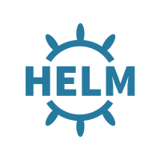
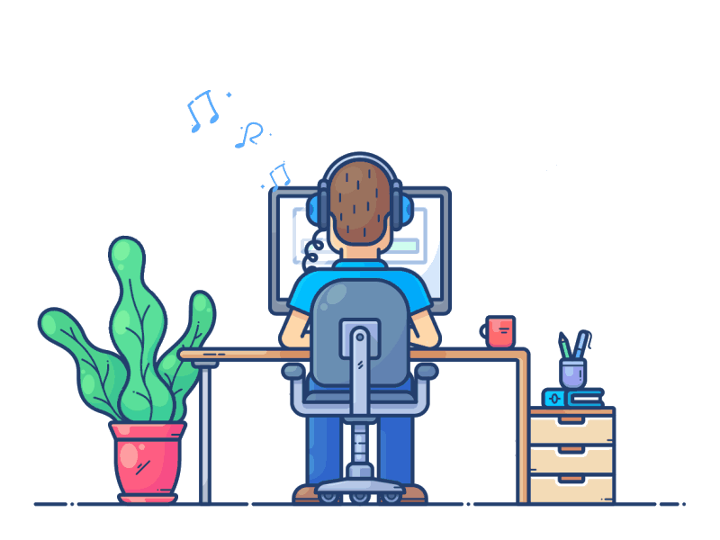

<!-- from Tynab repository :)) not atcual -->

<h1 align=center> Anton Shatokhin </h1>

</a>

 
 

<table align=left >
  <tr>
   <td>
   
- ### Back-end Development                                                                                   

  
  
  

- ### Database

  
  
  

- ### Continuos Integration / Development:

    
    
    
    
    

  
  
  
  
  
  
  
  
  
  
  
   
    ----------------------------------------------------------------------------
    </td>
   <td>
        
        

   </td>
  </tr>
</table>

